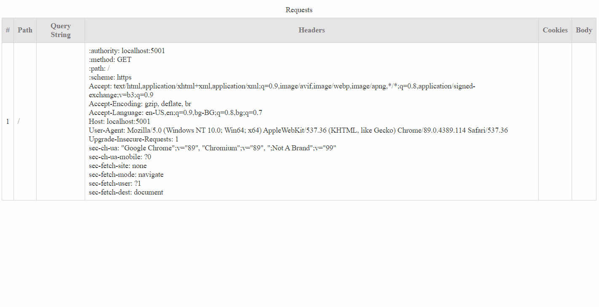

# Log Api

This is a very simple web api that displays the incomming requests. I recently needed something like this so I can debug my NodeMcu microcontroller. I wanted to see what I obtained and if I am able to send it somewhere.



## Installation 

The easiest way to use Log Api is with Docker.

### Docker:

1. Run:
```
Docker pull goes here
```
2. Open a browser and navigate to: http://localhost:5000/requests.html

### Dotnet

1. Clone or download the project
2. Build using Release configuration
3. Open cmd and navigate to LogApi\src\LogApi\LogApi\bin\Release\net5.0
4. Run:

```
dotnet LogApi.dll
```
5. Open a browser and navigate to: http://localhost:5000/requests.html

## Usage example

You can make any request to the port that you setup the project. It will collect information about the request and you can then see this information realtime by navigating to the /requests.html page.

### Configs

You can override any of the configs by changing them in appSettings.json or through environment variables.

| Parameter  | Default Value | Description |
| ------------- | ------------- |------------- |
| SocketAliveMinutes  | 10  | How long you will remain connected to the socket.  |
| RequestCleanerInMinutes  |  10  | How often should the cleaner run. |
| MaximumRequestsToKeep  | 1000 | How many requests to keep after the cleaner. |

## Meta

* Hasan Hasanov – [@hmhasanov](https://twitter.com/hmhasanov)
* Blog - [Hasan Hasanov](https://hasan-hasanov.com/)

## Contributing

1. Fork it (<https://github.com/yourname/yourproject/fork>)
2. Create your feature branch (`git checkout -b feature/fooBar`)
3. Commit your changes (`git commit -am 'Add some fooBar'`)
4. Push to the branch (`git push origin feature/fooBar`)
5. Create a new Pull Request
